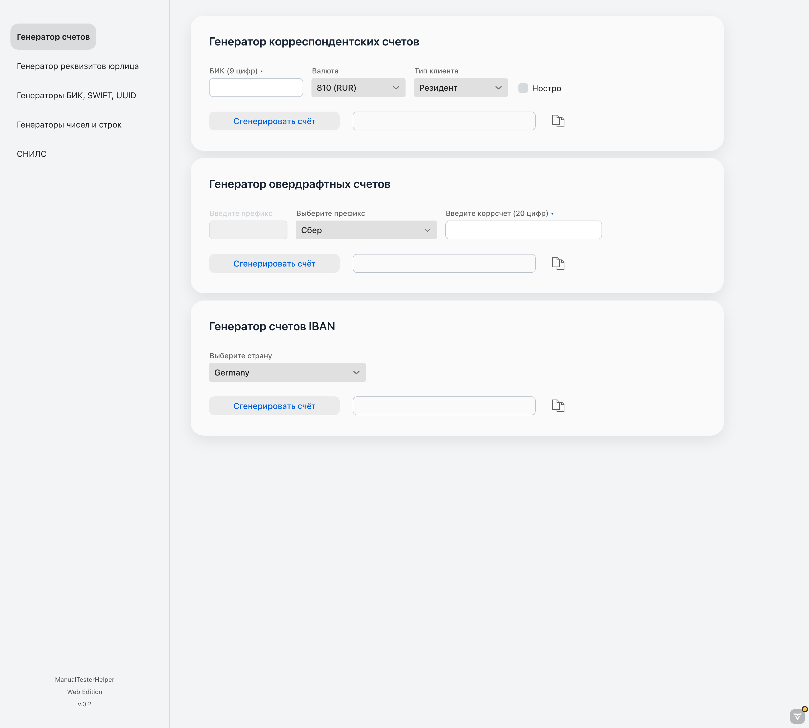
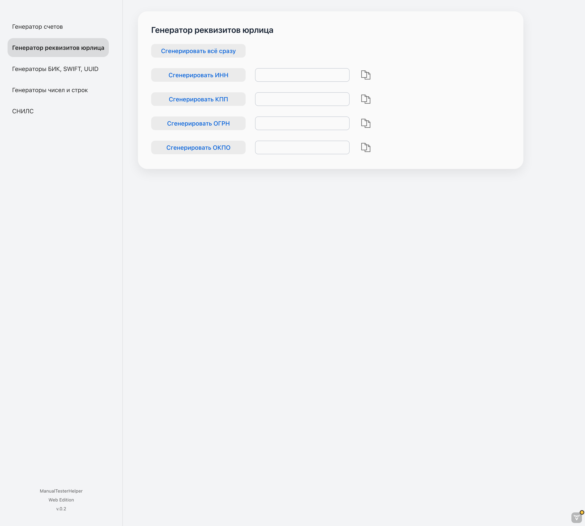
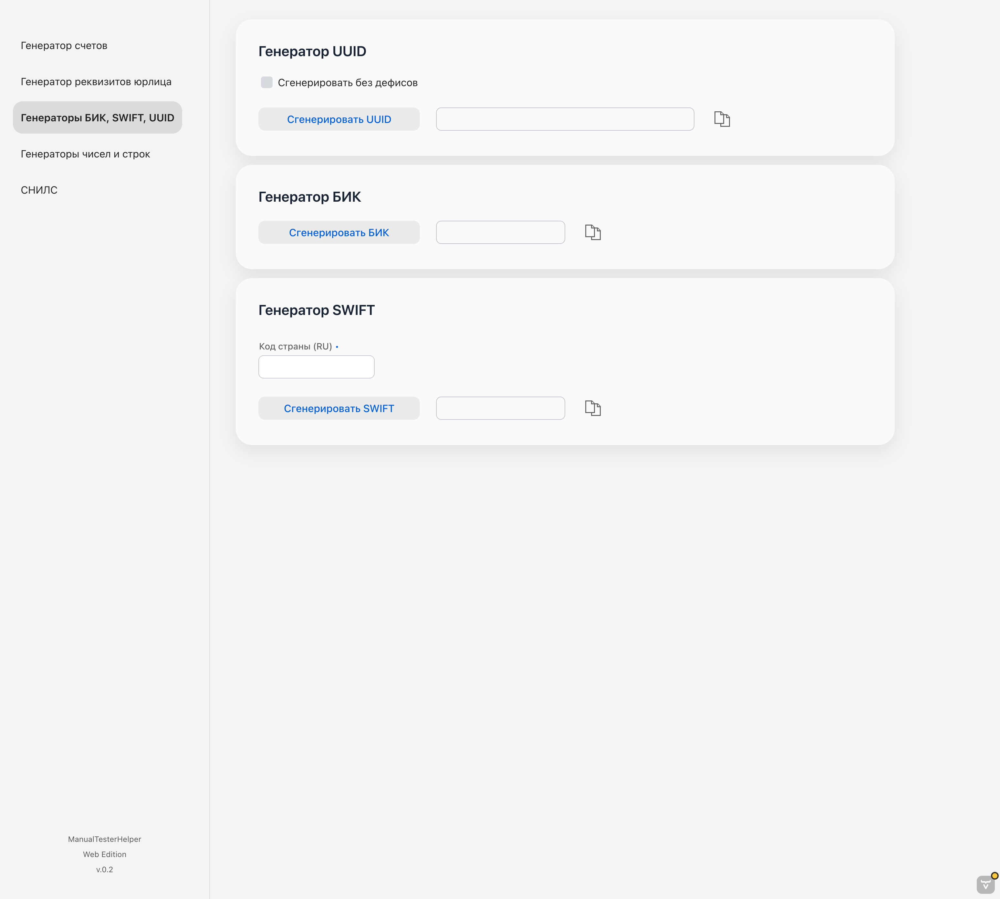
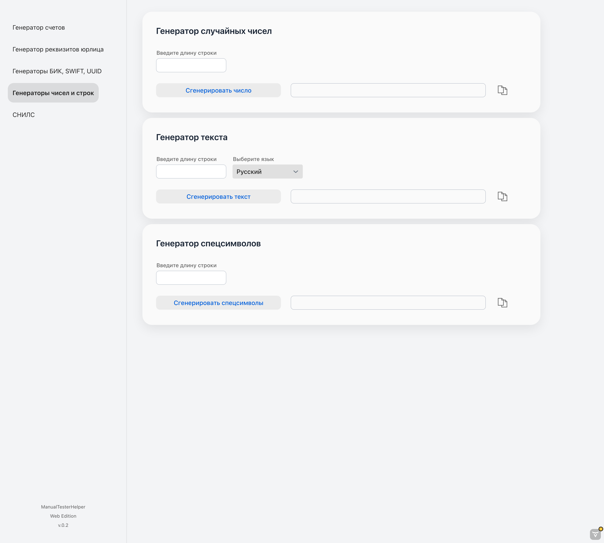
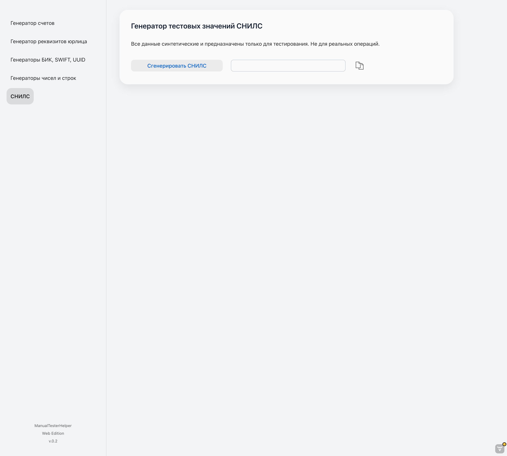

# 🧰 ManualTesterHelper Web Edition



<p align="center">
  
  
  
  
</p>

[](https://www.oracle.com/java/)
[](https://spring.io/projects/spring-boot)
[](https://vaadin.com/)
[](https://gradle.org/)
[](LICENSE)

## ⚠️ Disclaimer

All data generated by **ManualTesterHelper Web Edition**  
(INN, KPP, OGRN, OKPO, BIC, SWIFT, account numbers, UUIDs, strings, numbers, etc.)  
are **synthetic test values**.

These identifiers **do not correspond to real organizations or banks**  
and must **not** be used in production systems, documents, or financial operations.  
The application is intended **for testing, demonstration, and educational purposes only**.

Все данные, генерируемые ManualTesterHelper Web Edition, являются  
**синтетическими тестовыми значениями** и не предназначены  
для использования в реальных сервисах или документах.  
Совпадения с реальными организациями случайны.

---

[🇷🇺 Русская версия](#-русская-версия) | [🇬🇧 English version](#-english-version)

---

## 🇬🇧 English version

**ManualTesterHelper Web Edition** is a web-based version of the [ManualTesterHelper desktop application](https://github.com/RoyalSpirit/ManualTesterHelper).  
It provides the same functionality and behavior as the JavaFX version, delivered via a browser using  
**Spring Boot and Vaadin Flow**.

The project intentionally avoids UX experiments and follows a  
**1:1 functional and behavioral port** of the desktop application.

---

### 🚀 Features

- Generate legal entity identifiers: INN, KPP, OGRN, OKPO, KIO, BIC, SWIFT and correspondent accounts.
- Generate UUIDs, random numbers, strings, and characters.
- Strict input validation (length, format, allowed characters).
- One-click copy to clipboard (browser-supported).

---

### 🧩 Technologies

- **Language:** Java 21
- **Backend:** Spring Boot 3
- **UI Framework:** Vaadin Flow
- **Build System:** Gradle 8
- **Architecture:** View → Service → Generator
- **Reusable UI components:** `ResultRow`, `ResultRowOptions`

---

### 🏗 Architecture Notes

- Views do **not** access generators directly.
- All generators are invoked through `GeneratorService`.
- No additional features or UX changes are introduced without explicit intent.

---

### ⚙️ Build and Run

#### 📍 Requirements
- **JDK 21+**
- **Gradle 8+**
- Modern browser (Chrome / Edge / Firefox)

---

#### ▶️ Run locally

```
./gradlew bootRun
```

The application will be available at:

```
http://localhost:8050
```

(The port can be configured via `application.properties`.)

---

#### 📦 Build JAR

```
./gradlew clean build
```

Resulting artifact:

```
build/libs/ManualTesterHelperWebEdition-x.x.x.jar
```

Run manually:

```
java -jar build/libs/ManualTesterHelperWebEdition-x.x.x.jar
```

---

### 🌐 Deployment Notes

- All frontend-related files (`package.json`, Vite config, TypeScript files)  
  are **managed automatically by Vaadin Flow**.

---

### 📜 License

Distributed under the **MIT License**.  
Author: [Evgeny Lyashchuk](https://github.com/RoyalSpirit)

---

## 🇷🇺 Русская версия

**ManualTesterHelper Web Edition** — веб-версия приложения ManualTesterHelper, помогающее в ручном тестировании. 

Приложение полностью повторяет поведение [desktop-версии](https://github.com/RoyalSpirit/ManualTesterHelper) и позволяет **генерировать тестовые данные**: ИНН, КПП, ОГРН, БИК, SWIFT, корреспондентские счета, случайные строки и числа.

---

## 🚀 Возможности

- Генерация реквизитов юридических лиц (ИНН, КПП, ОГРН, ОКПО, КИО, БИК, SWIFT, корр. счета).
- Генерация UUID, случайных чисел, строк и символов.
- Копирование значений в буфер обмена.

---

## 🧩 Технологии

- **Java 21**
- **Spring Boot 3**
- **Vaadin Flow**
- **Gradle 8**

---

## 📂 Структура проекта (упрощённо)

```
src/main/java/
           └─ demo/web/
                │   └─ ui/              # Views
                │      ├─ components/   # ResultRow и переиспользуемые UI-компоненты
                │      └─ util/         # UI-утилиты и валидация
                ├─ service/             # GeneratorService
                ├─ generators/          # Генераторы данных
                └─ domain/              # enum'ы и модели
src/main/resources/
            └─ application.properties   # параметры Spring Boot and Vaadin Flow

```

---

### 📜 Лицензия

Проект распространяется под лицензией MIT.  
Автор: [Evgeny Lyashchuk](https://github.com/RoyalSpirit)

---

### 💬 Обратная связь

Если вы нашли баг или хотите предложить улучшение —  
создайте Issue или Pull Request.
